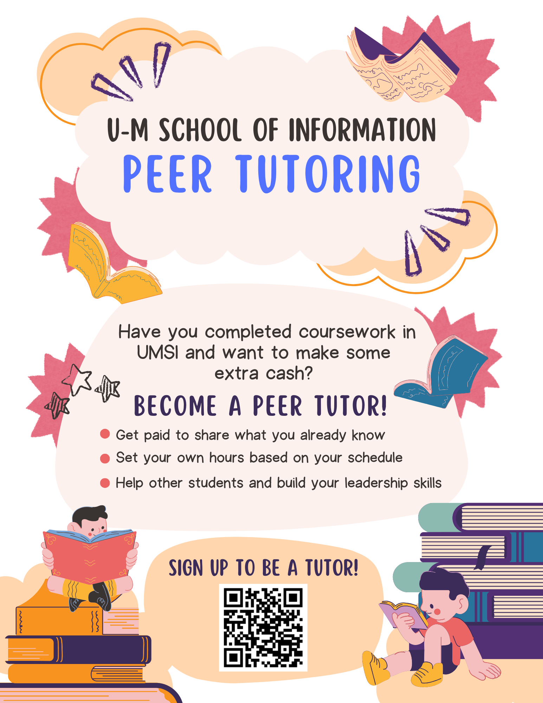

<section class="hero">
  

    
Student-led Tutoring Services Initiative

    <h1>University of Michigan Peer-to-Peer Tutoring</h1>
    

      This is a student-led initiative to connect students to peer tutors who might be in the same program as them or
      have taken the same course(s), in order to help them learn and grow academically. The goal is to have a directory
      of active tutors (who are also UoM students) available for students to contact and be able to get help. This
      resource is for graduate studies at the School of Information, Computer Science, and Electrical and Computer
      Engineering. Please find links to the tutoring resource and for tutor sign-up below.
    

    

      <a class="btn primary" href="#resources">Explore resources</a>
      <a class="btn secondary" href="#registration">Become a tutor</a>
    

  

</section>

<section id="project-description" class="project-description">
  <h2>Project Description</h2>
  

    This grassroots project is maintained by graduate student volunteers who understand the value of connecting with
    peers who have already navigated the same coursework. We are steadily expanding the directory and processes needed
    to make peer-led tutoring more accessible across the University of Michigan's School of Information, Computer
    Science, and Electrical and Computer Engineering programs.
  

</section>

<section id="resources" class="resource-section">
  

    <h2>Available Tutoring Resources</h2>
    
Browse the growing list of tutors who are ready to support you.

  

  

    <article class="info-card">
      <h3>Existing Tutor Directory</h3>
      <ul class="link-list">
        <li>
          <strong>UMSI:</strong>
          <a href="https://docs.google.com/spreadsheets/d/1yysrhL4NU9YjcQxBL2rdFVTXEULv2Q7KedEoUycke6M/edit?usp=sharing" target="_blank" rel="noopener">Google Sheet</a>
        </li>
        <li>
          <strong>ECE/CSE:</strong>
          <a href="https://docs.google.com/spreadsheets/d/12I3PiCiVA8ShNPx4MfZJ8IiDhGO19FkJGYP7-wUERRw/edit?usp=sharing" target="_blank" rel="noopener">Google Sheet</a>
        </li>
      </ul>
    </article>
    <article class="info-card" id="registration">
      <h3>Peer Tutor Registration</h3>
      <ul class="link-list">
        <li><strong>UMSI:</strong> <a href="https://forms.gle/4rvr5CTNZFKFrW1v7">Form link</a></li>
        <li><strong>ECE/CSE:</strong> <a href="https://forms.gle/ziq5snjG8Ku2iK5N9">Form link</a></li>
      </ul>
    </article>
    <article class="info-card">
      <h3>UMich Resources &amp; Support</h3>
      <ul class="link-list">
        <li><a href="https://ece.engin.umich.edu/academics/undergraduate/advising/tutoring/">EE Undergraduate Tutoring Information</a></li>
        <li><a href="https://ecas.engin.umich.edu/">Engineering Center for Academic Success (ECAS)</a></li>
        <li><a href="https://sites.google.com/umich.edu/umsitutoring/home">UMSI Tutoring &amp; Peer Support</a></li>
      </ul>
      
<em>Note: These resources are primarily for undergraduate courses.</em>

    </article>
    <article class="info-card" style="grid-column: 1 / -1; background: transparent; border: none; box-shadow: none; text-align: center;">
      <h3>Contact Information</h3>
      
<a href="mailto:peer.tutoring@umich.edu">peer.tutoring@umich.edu</a>

    </article>
  

</section>

<section class="flyer-section" id="flyer">
  

    <h2>Program Flyers</h2>
    
Download and share these flyers with your classmates to spread the word about peer tutoring.

  

  

    

      <h3>UMSI Flyer</h3>
      

        
      

      <a class="btn secondary" href="assets/images/UMSI.png" download>Download Image</a>
    

    

      <h3>ECE/CSE Flyer</h3>
      

        
      

      <a class="btn secondary" href="assets/images/ECE and CSE.png" download>Download Image</a>
    

  

</section>

